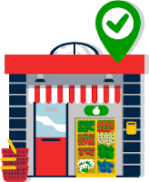

# Brand and services open during Covid-19 lockdown

Which chain stores or services are open during Covid-19 lockdown ? [Answers are here](rules.csv) and [here](legal_rules.csv) !

The objective of this repository is to list rules applicable to services and chain stores worldwide concerning their opening during the Covid-19 lockdown period. This allows to create maps like [Ça reste ouvert](https://caresteouvert.fr) (it stays open in French) of open shops and services during lockdown.

Examples :
* Do-it-yourself are only allowed to offer delivery or drive-through services
* Do-it-yourself brand "Pro hardware" is open country-wide from 09:00 to 18:00
* Bakeries are allowed to open country-wide
* But bakery brand "Bonne baguette" is closed country-wide

## How you can contribute

### Report info about chain stores

To report information about a chain of stores (at least 10 shops, for independent shops please use [opening_hours:covid19 tag on OpenStreetMap](https://wiki.openstreetmap.org/wiki/Key:opening_hours:covid19)), you can [create an issue](https://github.com/PanierAvide/Covid_enseignes/issues) in this repository.

What you will need to complete the issue:

* __Brand__ : brand name of concerned shops
* __Category__ : what kind of shop it is (supermarket, fuel, laundry...)
* __Opening rule__ : shops closed / shops open as usual / shops open with adapted opening hours (give some details : on appointment, only by delivery...)
* __Wikipedia / Wikidata__ : (optional) URL to Wikipedia or [Wikidata](https://www.wikidata.org/) page
* __Opening hours__ : (optional) URL to web page with opening hours list for shops
* __Source__ : URL to web page where you got info from

__Before creating an issue__, please check that info you want to report [is not already listed](rules.csv) or [in another open issue](https://github.com/PanierAvide/Covid_enseignes/issues?q=is%3Aissue).

__Pro-tip__ : to easily find missing brands, you can have a look at [this CSV file](https://download.osmontrouge.fr/caresteouvert/stats_brand_count.csv), which lists brands found in "Ça reste ouvert" data. Open it in a spreadsheet software (like LibreOffice), then filter on most recent date. Look at brands with `unknown` status, there are many chances they don't exist in our repository.

### Report info about legal opening/closing status in your country

To report information about legal opening status of various kind of places in your country, you can [create an issue](https://github.com/PanierAvide/Covid_enseignes/issues) in this repository.

What you will need to complete the issue:

* __Country and area__ : country and political subdivision where rule apply
* __Category__ : what kind of shop or service is concerned (supermarket, fuel, laundry...)
* __Legal opening rule__ : legally allowed to open, legally closed, can legally open only for delivery/takeaway/housing...
* __Time period__ : date range for which this rule apply
* __Source__ : URL to web page where you got info from (preferably government source)

__Before creating an issue__, please check that info you want to report [is not already listed](legal_rules.csv) or [in another open issue](https://github.com/PanierAvide/Covid_enseignes/issues?q=is%3Aissue).

### Integrate information

Based on open issues, and if you're comfortable with GitHub, you can integrate information received into CSV files `rules.csv` and `legal_rules.csv`. Then, offer a pull request to the master branch, and remember to link the corresponding issue in your commit comment.

## Result

The aim is to produce a worlwide map showing open shops during lockdown, and their associated opening hours. This is useful because :

* It avoids useless trips to closed shops
* It makes easier to find a shop near you instead of going far from your home
* It allows to see how things are evolving during the lockdown

### Open chain stores (`rules.csv`)

All data is compiled in [a single spreadsheet file](rules.csv) `rules.csv`, which defines received opening rules to be used with OpenStreetMap and Wikidata. It has the following format (encoding : UTF-8, delimiter : `,`) :

* `country` : 2-letters, uppercase country code ([ISO 3166-1 alpha-2 code](https://en.wikipedia.org/wiki/ISO_3166-1_alpha-2))
* `category` : category of chain stores (following OpenStreetMap tagging)
* `brand_name` : chain name
* `wikidata_id` : Wikidata identifier (starting with `Q`)
* `opening_rule` : opening status of stores (possible values : `open` = as usual, `open_adapted` = open with specific opening hours, `partial` = not all shops are opened, `closed` = all shops are closed)
* `opening_hours` : opening hours of __all stores__ (following [OpenStreetMap opening_hours tagging scheme](https://wiki.openstreetmap.org/wiki/Key:opening_hours))
* `osm_additional_tags` : supplementary [OpenStreetMap tags](https://wiki.openstreetmap.org/wiki/Key:opening_hours:covid19) in JSON object format (other than `opening_hours:covid19` and `brand:wikidata`) which can be applied on __all stores__. This is useful to inform about temporary delivery or takeaway services.
* `description` : information about shop accessibility, reduced services...
* `source_url` : URL of web page where you find info from
* `opening_hours_url` : URL of web page where opening hours during lockdown are listed

### Stores and services legally allowed to open (`legal_rules.csv`)

Data about legal opening status is compiled in [a single spreadsheet file](legal_rules.csv) `legal_rules.csv`, listing what can or cannot be open in a given country, for a given period. __This doesn't mean everything will be open__, but that these types shop can open if they want to. It has the following format (encoding : UTF-8, delimiter : `,`) :

* `country` : 2-letters, uppercase country code ([ISO 3166-1 alpha-2 code](https://en.wikipedia.org/wiki/ISO_3166-1_alpha-2))
* `country_subarea` : (optional) 2-letters, uppercase country code ([ISO 3166-1 alpha-2 code](https://en.wikipedia.org/wiki/ISO_3166-1_alpha-2)), followed by `-` character and reference of a sub-area in country. For example, `FR-35` for Ille-et-Vilaine department in France.
* `category` : category of chain stores (close to OpenStreetMap tagging)
* `category_osm` : JSON list of OpenStreetMap tags. Each object in list is a combination of necessary tags. Example `[ { "amenity": "bank", "bank": "pro" }, { "shop": "money_lender" } ]` = (amenity=bank AND bank=pro) OR (shop=money_lender).
* `start_date` : start date for period the rule is valid, in YYYY-MM-DD format
* `end_date` : (optional) end date for period the rule is valid, in YYYY-MM-DD format
* `legal_state` : legal opening status for this category. Values can be : `open` (no restriction), `only:...` (comma-separated restricted list of allowed services), `closed` (fully closed). By default, if a category doesn't appear in CSV file, __we consider it as closed__.
* `source_url` : URL of web page where your information comes from (preferably from government source)

### Open chain stores in France (`regles.csv`)

For backward compatibility, another __deprecated__ file `regles.csv` is also available (only French shops) with this format :

* `nom_enseigne` : nom de l'enseigne
* `categorie` : type de commerce (en Anglais, selon la description OpenStreetMap : `supermarket`, `bakery`...)
* `id_wikidata` : identifiant Wikidata de cette enseigne
* `url_source` : lien URL où les infos d'ouveture/fermeture sont renseignées
* `url_horaires` : en cas d'horaires adaptées, lien URL recensant les horaires
* `regle_ouverture` : statut d'ouverture des magasins (valeurs possibles : `ouvert` = pas de changement, `ouvert_adapté` = ouvert avec horaires adaptés, `partiel` = certains magasins fermés, `fermé` = tous les magasins fermés)
* `horaires` : horaires au format `opening_hours` OpenStreetMap __si valables pour tous les commerces__ de l'enseigne
* `infos` : champ texte libre d'informations supplémentaires

## License

Copyright 2020 [Adrien PAVIE](https://pavie.info)

Data under Creative Commons Public Domain License (CC0), see [full license](LICENSE) for details.

JavaScript code under [GNU Affero General Public License](https://www.gnu.org/licenses/#AGPL).
